# My 10 takeaways from the 2019 Intelligent Vehicle Symposium

!!!! WORK IN PROGRESS !!!!
*If some pictures are not loaded, try to refresh the page.*

| 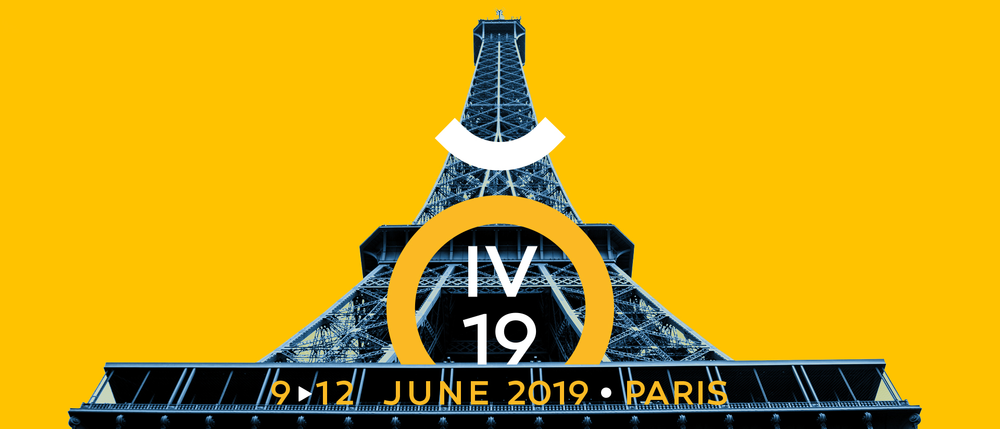  |
|:--:|
| *2019 Intelligent Vehicle Symposium* |

```bash
TL;DR:
- Look how other industries (e.g. aviation) deal with risk assessment and decision making under uncertainty.
- Abandon the *Vision Zero* buzzword.
- Stop separating prediction and planning and use POMDP formulations.
- Combine learning and planning (e.g. MCTS + RL).
- Interaction-aware planning.
- Think distribution, not expectation or point-estimate.
- Generalize with decomposition or image-like states.
- Some demos were impressive. But far from series production.
- ... # todo
```

Last week, experts from the autonomous driving (AD) world came together for the 2019 IEEE Intelligent Vehicle Symposium ([IV19](https://iv2019.org/)) in Paris to discuss about research and applications for autonomous driving.

This **30th edition** included one full day of **workshops and tutorials**, two days of **oral presentations**, **poster sessions** and **keynotes** as well as one whole day of **on-track demonstrations**. Not to mention the several **social events** that were ideal for deeper discussions and intense debates.

Some interesting figures:

- Around `700` attendees.
- `525` paper submissions.
- `62%` acceptance rate.
- More than `1100` reviewers.
- Authors coming from `37` countries, with almost **one third from Germany**, `16%` China, `14%` USA, `7%` France, `5%` Japan. *I sometime felt more in Germany than in France!*

From the [List of Events for Autonomous Driving Engineers and Researchers](https://github.com/esrlabs/Conferences-for-Autonomous-Driving), IV was identified as a top priority for our [Machine Learning Team](https://www.esrlabs.com/works/autonomous/). I would like to **thank [ESR Labs AG](https://www.esrlabs.com)** for this opportunity to exchange, during four days, with other engineers, researchers, practitioners, and students, from industry, universities and government agencies about the latest trends, insights and challenges related to the fast-moving field of AD.

In this post, I would like to **share some personal highlights** about the latest exciting trends in decision making for autonomous driving.

Disclaimers:

- These notes are **personal highlights** and do **not aim at being an exhausted review** of the IV19 publications.
- I mainly focus on the topic of **decision making for AD** (as opposed to perceptions, localisation or control for instance).
- Many subjects I am discussing are new to me. I really hope I did not misinterpret any concept when referencing to papers. Please notify me if any statement or interpretation is incorrect!

## Structure

- [Uncertainty](#my-multi-word-header)
  - [Sources of uncertainty](#sources-of-uncertainty)
  - [Heteroscedastic Uncertainties](#heteroscedastic-uncertainties)
  - [Unfreezing the Robot under Occlusion](#unfreezing-the-obot-under-occlusion)
  - [Reducing Uncertainty](#reducing-uncertainty)
- [Do not Forget Safety](#do-not-forget-safety)
  - [Safety Proof for AD](#safety-proof-for-ad)
  - [RSS](#rss)
  - [Reachability analysis](#reachability-analysis)
  - [Risk Assessment and Safety Checkers](#risk-assessment-and-safety-checkers)
- [Generalization in decision modules](#generalization-in-decision-modules)
  - [Generic scene representation](#generic-scene-representation)
  - [Scene decomposition methods](#scene-decomposition-methods)
- [Considering interaction between traffic participants](#considering-interaction-between-traffic-participants)

## Reinforcement Learning

## Partially Observable Markov Decision Process (POMDP)

## Social Benefits of AD

## Uncertainty

> “It is far better to foresee even without certainty than not to foresee at all” - Henri Poincaré

I have already mentioned that belief state planning like POMDP has the potential to significantly improve robustness of AD. They give the ability to reason about the future given the uncertain information about latent states and the future behaviours.

In this section, I would like to examine:

- The sources of uncertainty.
- The use of probabilistic distributions in action selection and prediction.
- The case of occlusion.
- Some techniques to reduce uncertainty in AD.

### Sources of uncertainty

Christoph Stiller, one of the fathers of KITTI datasets, starting his keynotes by listing the sources of uncertainty**. He grouped them into four categories.

- Uncertainty due to **noise** in perception.
- Uncertainty due to **occlusion** and **limited sensor range**.
- Uncertainty in **maps** and localisation.
- Uncertainty in the **intent** of other traffic participants. More generally this encompass all the **social behavioural uncertainties**, such as local driving preferences.

| 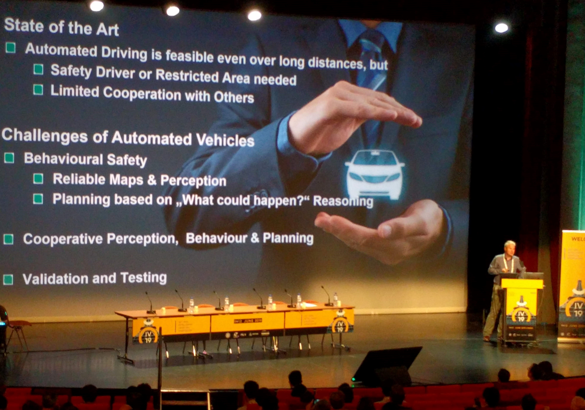  |
|:--:|
| *Keynote by Christoph Stiller. Source: author provided.* |

To deal with occlusions, Christoph Stiller mentioned the benefits of reasoning in terms of reachable sets, referencing the work of his team (Orzechowski, Meyer, and Lauer 2018).

He then spent a long time discussing about uncertainties in **maps** and **localisation**. Maps contain information used for **tactical long-horizon decision making** such as the possible actions that one can take at that crossing or simply the speed limitation. But if maps **do not get updated** as the environment changes, it can be **very misleading**.

This situation made me think of a quote about software engineering:

> No documentation is better than a deprecated documentation.

On a highway **construction site**, for instance, lanes could have been **laterally shifted by two meters**. The relative position between lane markers on the road may remain valid, but their positions will not match anymore with signs and poles. This could cause a **large trouble** in the **visual-based localization**.

To address the question of **trust in map**, especially in building zones, Christoph Stiller mentioned a [dataset](https://www.mrt.kit.edu/software/mapvalidation/) for map verification. Recordings have been performed on roads before and during a construction work.

One conclusion is that the AD vehicle should ideally be able to **get rid of map if it is causing difficulties**.

### Heteroscedastic Uncertainties

Another commonly-used classification of uncertainty distinguishes two categories.

- Aleatoric Uncertainties. There are of statistical origin and apply especially for sensors. The noise inherent to measurement is often modelled by introducing probability densities, such as Gaussian distributions in the case of Kalman filters for instance.
- Epistemic Uncertainties. They describe missing or incomplete information such as occluded areas. In this case hypothetical objects are considered.

> I learnt a new term: “Heteroscedastic Aleatoric Uncertainties”!

| ![The variance in the actions can vary. In the first half section (`t` `∈` [`0`; `100s`]), the estimate is highly confident (zero variance) since the vehicle is driving on a straight road. When approaching the intersection, the estimation shows more uncertainty. Source: (Schulz et al. 2019).](media/pics/schulz_heteroscedastic.PNG "The variance in the actions can vary. In the first half section (`t` `∈` [`0`; `100s`]), the estimate is highly confident (zero variance) since the vehicle is driving on a straight road. When approaching the intersection, the estimation shows more uncertainty. Source: (Schulz et al. 2019).")  |
|:--:|
| *The variance in the actions can vary. In the first half section (`t` `∈` [`0`; `100s`]), the estimate is highly confident (zero variance) since the vehicle is driving on a straight road. When approaching the intersection, the estimation shows more uncertainty. Source: (Schulz et al. 2019).* |

(Schulz et al. 2019) learn a **probabilistic mapping** from context and route intention to **some action distribution** (acceleration and steering). Since the **variance is not constant** (contrary to *homoscedastic* regressions), this mapping is said **"heteroscedastic"**. It can express the **varying uncertainty in the choice of action** depending on the situation. The negative *log likelihood* is used as a loss function to learn both the mean and variance in one training procedure.

(Pool, Kooij, and Gavrila 2019) and (Zernetsch et al. 2019) also include uncertainty in prediction by outputting a Gaussian distribution over the future position.

| .")  |
|:--:|
| *Incorporating uncertainties in trajectory prediction. Source: (Zernetsch et al. 2019).* |

But modelling a future trajectory with a Gaussian could be problematic. Especially when considering multiple possible routes at an intersection. Instead of **predicting positions with ellipses**, (Hu, Zhan, and Tomizuka 2019) assign **intention probability** to some **reference paths**. This is known as *multi-modality prediction*.

| .")  |
|:--:|
| *Example of multi-modality in trajectory prediction. Source: (Hu, Zhan, and Tomizuka 2019).* |

Uncertainty quantification can also be applied to **action selection and control**. The policy learnt in (Folkers, Rick, and Christof 2019) does not return a single action value but rather a pair (`µ`, `σ`), i.e. the **mean and standard deviation of a gaussian probability distribution** for each possible action.

The **distributional perspective** is also applied by (Bernhard and Knoll 2019) where a value-based **Distributional RL** method is used. In common *value-based* MDP and POMDP solvers (e.g. *classical DQN*, *MCTS*, *Adaptive Belief Tree*), the cumulated discounted reward is **expressed as an expectation**. The term *Distributional* in their approach means that learnt value function is not a single numeric value. But rather a **distribution**.

This concept reminds me the DeepMind post blog [*Going beyond average for reinforcement learning*](https://deepmind.com/blog/going-beyond-average-reinforcement-learning/) introducing [C51](https://arxiv.org/abs/1707.06887).

In (Bernhard and Knoll 2019), the value-distribution function is learnt offline and can be then used to select risk-sensitive actions. The selection differs from the classical RL approaches where the action with the **highest expectation** is chosen.

My interpretation is as follows. For safety reasons, we are interested in the **lower tail of the return distribution**. The action selection could be based on the **inverse CDF** at a certain percentage (e.g. `10%`). But as shown on the figure below, this percentage, representing a **risk measure**, differs between actions. It is around `50%` for the red distribution, and maybe less than `20%` for the other two. I must admit I did not understand all the details on how these risk metrics are computed. Anyway, the **action with the highest bound is selected** (*high. accel.* in the following figure).

| .")  |
|:--:|
| *Working with distributions instead of mean expectation enable to improve uncertainty-aware action selection. Source: (Bernhard and Knoll 2019).* |

Do you know how to **measure the difference between two probability distributions**? I knew the [KL-divergence](https://en.wikipedia.org/wiki/Kullback%E2%80%93Leibler_divergence). Reading the paper, I discovered an alternative: the [Wasserstein metric](https://en.wikipedia.org/wiki/Wasserstein_metric), (a proper “distance” this time) used in the training phase.

While most of these methods for perception and decision-making **output an uncertainty measure**, they treat the information from localisation and perception as **point estimates** (with zero variance). Nevertheless, the **propagation of uncertainty measurements through all the AD modules** is essential.

(Bouton et al. 2019) model the perception noise by a Gaussian distribution around the position and velocity measurements. They also **add false positive** and **false negative detections** of cars and pedestrian.

More generally, the **environment representation** based on **probabilistic occupancy grids** used in (Barbier et al. 2019) seems appropriate to capture the perception uncertainty.

### Unfreezing the Robot under Occlusion

A common approach to deal with uncertainty is the **worst-case assumption**. But in highly complex scenarios, this can lead to the issue of *"Freezing Robot"*: uncertainty in future states explodes and the AD vehicle **does not find any valid action**. It stands still.

The POMDP formulation can address this issue. Being a **belief state planning** problem, it allows for **decision making under uncertainty**. (Schörner et al. 2019) use a POMDP to tackle uncertainty in occlusion. Similarly, (Hubmann et al. 2019) presents an **occlusion-aware POMDP** (OCAPOP) showing that:

> "Postponing the decision is not always a bad idea".

The idea is to simulate the potential **field of view** (*fov*) over the complete scenario and consider at the same time the **reachable set** for the vehicles that may be occluded. The reward function motivates an **increase in the _fov_** while **punishing lateral offsets**, which may be **conflicting** e.g. when following a tall vehicle.

The vehicle sometimes decides to **postpone the decision** about crossing the intersection and prefers increasing its _fov_ by **taking a lateral offset to capture more information**. This behaviour, called **"information gathering"**, allows for less conservative behaviour.
I think one could draw a parallel with the concept of *exploration* / *exploitation* used in RL. But here, this decision is taking when driving. Not during the training phase.

The resulting planner can drive nearly the same trajectories as an **omniscient planner would**.

| . The AD car keeps driving to increase its field of view. It contemplates two trajectories: a _direct left-turn_ (thick blue polyline) and a _backup stopping trajectory_ (thin blue polyline going down). As soon as a real vehicle pops out and is seen, the AD car executes the braking manoeuvre. Source: author provided – recorded during the SIPD workshop.")  |
|:--:|
| *The AD car wants to turn left. But the other vehicle is occluded by a building (black line with red point). The AD car keeps driving to increase its field of view. It contemplates two trajectories: a _direct left-turn_ (thick blue polyline) and a _backup stopping trajectory_ (thin blue polyline going down). As soon as a real vehicle pops out and is seen, the AD car executes the braking manoeuvre. Source: author provided – recorded during the SIPD workshop.* |

### Reducing Uncertainty

A first approach to reduce uncertainty consists in **direct communication** between traffic participants.

During his keynote, Christoph Stiller called for more research in **_“Cooperative perception, behaviour and planning”_**. He sees a huge potential to improve safety, reduce emission and increase the traffic flow efficiency.

Another approached, not based on V2V communication, was presented during the SIPD workshop. I really enjoyed this work on behavioural planning presented by (Sun et al. 2019). It introduces the concept of **"Social Perception"**. The idea is to **infer some information** about the environment by **observing the behaviour of other traffic participants**. Two quotes from them:

> “Human drivers on the road are intelligent agents whose behaviours can not only tell us what they want to do, but also what might have been missed by our own sensors.”

> “Human participants should be treated not only as dynamic obstacles, but also as distributed sensors that provide via their behaviours additional information about the environment beyond the scope of physical sensors”.

They show how it can be used to reduce uncertainty in the case of **occlusions** or **limited sensor range**.

| .")  |
|:--:|
| *From the behaviour of the other driver, the ego car can infer and become more confident about the probability of a pedestrian crossing. Source: (Sun et al. 2019).* |

## Do not Forget Safety

> “10 years ago, it was often said *Safety is not for research. It is for serious production*. Now, research cares about it.”

> "Academics love to be distracted by a future in which self-driving vehicles make life-or-death decisions while moving at high speed. Whether the robot trolley will crash into the businessman or the older woman is the question of the day." [Source](https://www.nature.com/articles/d41586-019-01473-3)

This topic was new to me. I have heard of:

- Safety Validation for AD
- RSS
- Model Checkers
- Reachability sets

### Safety Proof for AD

One big question was: _**"How to prove safety in AD?"**_

This question was addressed by Jack Weast, Vice President at Mobileye, in his keynote “An Open, Transparent, Industry-driven Approach to AV Safety”.

| 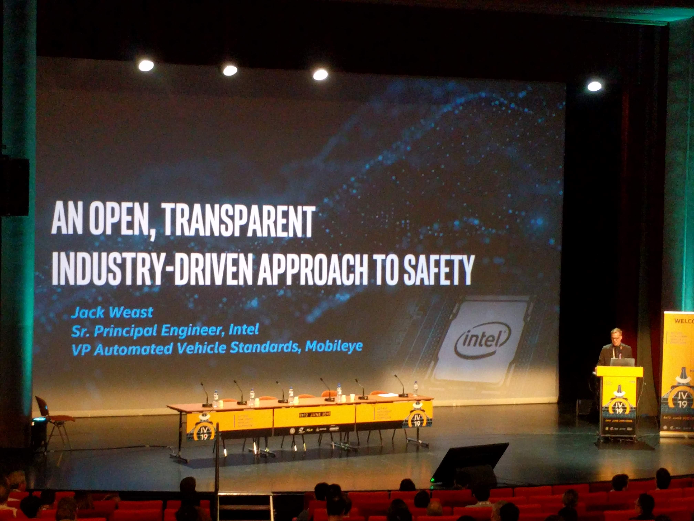  |
|:--:|
| *Keynote by Jack Weast. Source: author provided.* |

What do you want to mean by *safety*? Let us start by the definition _"AV is safe if it_ **doesn’t experience collisions**_"_.

**A first intuition could be to use statistics**. For instance, with an **expectation over the distance between two accidents**. That could be computed using the total number of accidents and the total distance travelled. But only considering the statistical argument is not a good metric, since **it does not capture the scenario complexity**. One kilometre driven in Paris, on narrow streets, with all these crazy electric scooters and reckless pedestrians cannot be fairly compared with drives on large and straight highways. And the Paris example seems easy compared to some situations in India. Not to mention the weather and day/night conditions.

A second intuition could be to just **make the vehicle follow the traffic rules and prove it always abides to them**. But following the rules is not enough to avoid a crash. Moreover, it can be sometimes **socially accepted and safer to break a traffic rule**. For instance, when crossing a solid line to takeover a badly-parked vehicle.

What about **testing the vehicle on many critical scenarios**? Potentially using simulation. Thousands of thousands of scenarios can be generated and tested. But **the world is complex, and humans are imaginative**. There will always be yet another critical scenario that has not been considered before.

Another idea could be to **try to avoid crashes** at all cost. And to (try to) prove it to the authorities. But this is not realistic. Imagine you are surrounded by cars that are coming together close to you. **Avoiding accidents is just impossible**.

| .](media/pics/rss_absolute_safety_impossible.PNG "Mobileye RSS and Nvidia SFF agree: an absolute safety is impossible as long as AVs share the road with human drivers. [Source](https://newsroom.intel.com/wp-content/uploads/sites/11/2019/03/Intel-SFFvsRSS-table.pdf).")  |
|:--:|
| *Mobileye RSS and Nvidia SFF agree: an absolute safety is impossible as long as AVs share the road with human drivers. [Source](https://newsroom.intel.com/wp-content/uploads/sites/11/2019/03/Intel-SFFvsRSS-table.pdf).* |

> Another definition is hence suggested: _"AV is safe if it_ **doesn’t cause collisions**_"_.

Instead of defining scenarios in advance or trying to avoid all collisions, Jack Weast suggested to **put constraints on the driving policy**, i.e. the decision making system, which leads to the introduction of **RSS**.

### RSS

Intel, as the Platinum sponsor, could advertise the mathematical model for AV safety named [Responsibility-Sensitive Safety](https://www.mobileye.com/responsibility-sensitive-safety/) (RSS) developed by its subsidiary Mobileye. The main idea of RSS is **to mimic human judgement using math formulation**. It acts like a **safety checker on the proposed actions** and can let them proceed on the actuators or not.

While RSS starts to become popular among the AD community, it seems it has already [inspired Nvidia](https://newsroom.intel.com/editorials/innovation-requires-originality/#gs.kiu5nl). 😉

[](http://www.youtube.com/watch?v=EceAB6TUYzo "Introduction to RSS")

First, RSS is based on the **notion of "blame"**: *ensure that the AV does not initiate any dangerous situation*.

This concept is implemented in (Naumann et al. 2019) for motion planning under occlusions, where two safety conditions are defined.

- (C1) Being in a **safe state before** the conflict zone.
- (C2) **Safely passing** the conflict zone.

Only trajectories that fulfil both can be selected, as stated by their authors:

> If we cannot ensure a safe trajectory through a conflict zone, we must ensure the reachability of a safe state before it.

I will remember a second idea of RSS: the model of **human implicit rules**.

Humans follow two kind of rules:

- **Explicit rules**. Such as *“should stop at a red light”*.
- **Implicit rules**. For instance, the US law says that you should drive at a *speed that is appropriate to the traffic condition*.

RSS model human implicit rules with **five principles**.

| 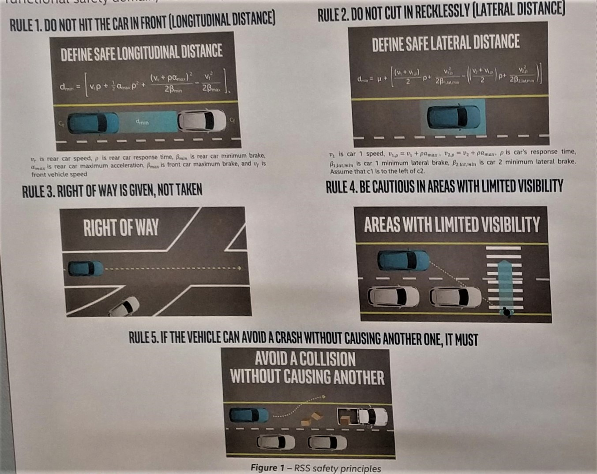  |
|:--:|
| *The five RSS principles meant to formularize human common sense. As opposed to explicit rules, they are subjective and open to interpretation. Source: author provided.* |

In addition to *concept of blame* and the *five human implicit rules*, I noted that **the RSS checker is based on parametrized models**. This can be shown by the presence of equations on the above picture (sorry - it is hard to see). This parametrization offers opportuinities and challenges.

- **Driving is cultural**. Regulators and governments can **plug in different numbers**, based on what they want. RSS can be **used as a metric**.
- But **estimating the RSS parameters can be complicated**. How would you estimate the **maximum braking capability** of the vehicle in front of view? The same as yours? The average on the market? What if it is a sport car with higher braking capabilities? This value, usually denoted by `β max`, plays a significant role in the model since it conditions the safe gap distance.

| 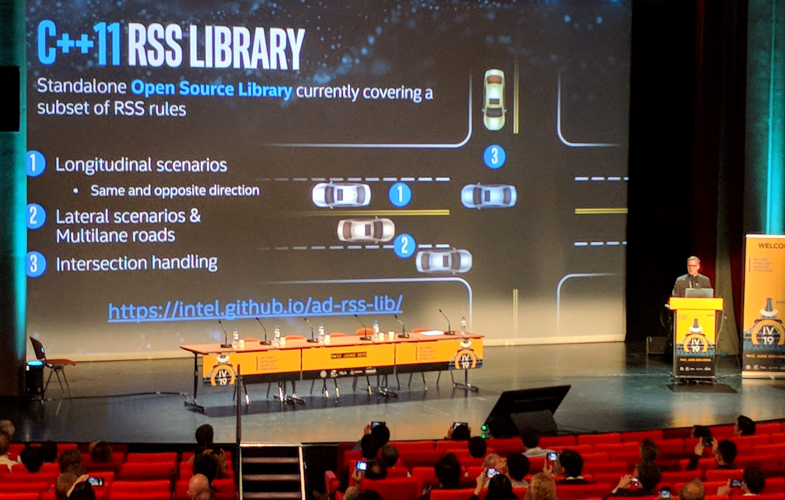  |
|:--:|
| *Presentation of AD-RSS-LIB. Source: author provided.* |

Finally, I have retained two main announcements from RSS:

- First, RSS will use the **KITTI dataset to infer RSS parameters** that best fit to the recorded human drivers. It made me think of Inverse RL approaches which aim at finding the reward function of an MDP, given some optimal demonstration. This will be particularly useful to offer a **more realistic** (yet German specific) model. But the question of `β max` will still remain.
- IV19 was the opportunity for Jack Weast to mention the release of a [library](https://intel.github.io/ad-rss-lib/) that provides a C++ implementation of RSS. It comes with support for integration with Baidu Apollo and CARLA.


| .")  |
|:--:|
| *First, the perceived information needs to be extracted according to the RSS world model. The RSS module provides then actuator command restrictions as output to enforce safe behaviour. The checker can be placed at several location: within the behaviour planner, around the planning module or outside the AD (CARLA example).* |

### Reachability analysis

During the three days of workshop and conference, I heard a lot about **reachability analysis** and **reachability sets**. These concepts were new to me.

During the [SIPD workshop](https://sites.google.com/berkeley.edu/iv19-interaction), Katherine Driggs-Campbell showed how to make **set-based prediction**. She distinguished between **two approaches** to modelling human behaviour: *informative* and *robust* methods. Using models learnt from a dataset, their method outputs so-called *empirical reachable sets*. The idea is to **reject unlikely samples up to some probability threshold**, in order to balance between *robustness* and *informativeness*.

| .")  |
|:--:|
| _Difference between **Informative** and **Robust** approaches for human behaviour modelling. Source : (Driggs-Campbell et al. 2017)._ |

That reminds me the [concept](https://www.youtube.com/watch?v=o9A4e7zopu8) of **precision** (*type I error* leading to *false positives*) and **recall** (*type II error* leads to *false negatives*) used in **object detection**.

When asked about future trajectory, one could draw a **very large set that is guaranteed to encapsulate all the possible trajectories**. This will present a **high recall** but will probably be **over-conservative** and not applicable for high speeds. Another option could be to **restrict the prediction to one single trajectory**, potentially with some uncertainty. This second method will offer a **high precision** but will be meet difficulties to guarantee safety.

Besides prediction, **reachable sets can be used in motion planning** and collision avoidance, as demonstrated in (Hartmann and Watzenig 2019). The **maximal jerk** in the motion of pedestrians is predicted iteratively using Gaussian processes. From these **physical constraints**, a **reachable set on positions** can be formulated and incorporated in the motion planning. It is finally solved with Mixed Integer Linear Programming (MILP).

| ")  |
|:--:|
| *Using reachability analysis for motion planning. Source: (Hartmann and Watzenig 2019)* |

Another example I liked was presented by (Pierson et al. 2019), where another type of set, *risk level sets*, is used to safely navigate **congested environments**. The authors define a cost function and tune its parameters to fit the human data, based on the NGSIM and highD. Thresholds corresponding to low, medium, and high-risk driving are also learnt from these highway recordings.
These thresholds can be used for **planning with different supported risk**. The vehicle will seek a **path in the region when the estimated risk is below a certain threshold**. For instance, a low-risk agent will have a more restricted planning space. As a result, it will make fewer lane changes along the congested highway.

| ")  |
|:--:|
| *Planning can be based on Congestion quantification and risk assessment for the ego vehicle using risk level sets. Here a high-risk threshold is applied. Source: (Pierson et al. 2019)* |

This **risk-based decision making** was for me a paradigm shift. In many works, **criticality of a situation** is estimated using metrics like **time to collision** (TTC). But **evaluating the future situation risk** is probably **more human-like** than TTC-based collision avoidance.

> "Human response to traffic situations depends on their risk assessment and tolerance to risk." Source: (Pierson et al. 2019).

My takeover from all these sets is that active safety and driver modelling are tightly linked. Starting with concerns on safety guarantees, the reachability analysis naturally leads to the definition of solutions for planning and predictions.

I would like to end this section on safety by mentioning other techniques to embed risk assessment in decision modules.

### Risk Assessment and Safety Checkers

Besides RSS, other techniques for safety checker were presented.

(Barbier et al. 2019) proposed a method to validate perception and decision-making systems via *Statistical Model Checking*. The idea is to compute the **probability for a system to stay in a certain range of KPIs**, for instance for the acceleration to stay bounded.

Another interesting aspect is the use of **Bounded Linear Temporal Logic** (BLTL). Here, the term *bounded* means that the operators can be **parameterized by a time bound**. This method offers a finer formulation for validation. For instance, one can work with the **probability of crossing the intersection in less than a given time**.

Another point I liked was their method for **risk assessment** at road intersections. The idea, built from their previous work (Barbier et al. 2018), is to compute the **difference between what the driver IS DOING** (called *intention*) and **what a driver SHOULD DO** according to priority rules (called *expectation*). Situations where *intention* and *expectation* do not match could result in a risky interaction. The resulting discrepancy can be useful for risk assessment since it can **capture some misinterpretation** of the scene by the ego vehicle, especially in scenarios with occlusion.

LTL was also applied in (Esterle, Aravantinos, and Knoll 2019), not for safety or risk assessment but for traffic rule compliance. They show how LTL can be used to verify high-level manoeuvre plans. As argued, **"this may help shift part of the development from writing code to writing specifications"**. The idea is to construct *semantic traces* that represent possible manoeuvre variants. And then to check whether each trace satisfies the specified traffic rules. **Vienna Convention of Traffic Rules** are used described in the LTL formulas.

| .")  |
|:--:|
| *Semantic traces are first generated depending on the scenario. Their validity with respect to LTL rules are then checked. Source: (Esterle, Aravantinos, and Knoll 2019).* |

In their conclusion, the authors point that it should be allowed to **violate some rules in emergency situations**. They suggest investigating the difference between *soft* and *hard* rules to distinguish between *should* and *must*.

In the previous sections, I have been advocating for the POMDP formulation. I was interested to know how safety checkers can be incorporated to MDP and POMDP.

In many previous works about MDP, a deterministic **action masking mechanism** was used. For instance, in the lane changing problem, if the ego car is in the left most lane, then taking a *left* action will result in getting off the road. Therefore, a mask can be put on the *Q-value* associated with the left action to ensure it is never selected in such a state.

At IV19, (Bouton et al. 2019) presented a probabilistic model-checker for POMDP, using RL. The advantage is that the threshold can be adapted depending on the risk acceptance.

As I understood, for a **particular reward function**, the **optimality value (or *utility*) function** of an MDP is the **probability of reaching the goal safely**. This utility function can be learnt offline using value iteration. The values, in this case probabilities, are then used to learn the policy: the RL agent can **chose among the set of actions** that have a **probability of safety larger than a safety threshold**.

Finally, during the SIPD workshop, Mykel Kochenderfer mentioned a [project](https://github.com/sisl/POMDPModelChecking.jl) from his team on verification in POMDP from LTL formulas. It relies on [`POMDPs.jl`](https://github.com/JuliaPOMDP/POMDPs.jl) for expressing the POMDP model and [`Spot.jl`](https://github.com/sisl/Spot.jl) for manipulating LTL formulas.

|   |
|:--:|
| *POMDP Model Checker. Source: author provided.* |

As I understood, the [SPOT library](https://spot.lrde.epita.fr/index.html) is used to translate an LTL formula into some automata. This automata is then combined with the POMDP model and generates a larger POMDP that can be solved with modern solvers. The output is the probability that the LTL formula is verified.

Mykel Kochenderfer ended his presentation by mentioning two remaining **challenges about safety checker for decision making**:

- It is still not clear **how to show** that the system that comes out of this **optimization** can be trusted.
- **POMDPs with integrated model checkers** can be huge and works still need to be done to overcome the **computational tractability**.

## Generalization in decision modules

Most authors show the relevance of their approaches on one or few scenarios. Usually with a fix number of traffic participants and a specific/arbitrary road layout. I was wondering how these approaches can **generalize to a different road structure**, in diverse scenarios with **a various number of participants**.

A first challenge concerns the **computation**. Scaling to more than two-agent interactions is challenging due to the **Curse of Dimensionality** (_problem caused by the exponential increase in volume associated with adding extra dimensions to Euclidean space_), as introduced by R. Bellman in 1957.

I found two interesting methods:

- Generic scene representation.
- Scene decomposition methods.

### Generic Scene Representation

Generalization raises the **question of representation**. Vectors of **features** such as *distance to the other vehicle* and *relative velocity to the cyclist* can be used. But the **variation in the number of participants** will change the **size of the joint representation**. And the **non-constant size of the input** may be problematic for the algorithm, such as neural networks.

Instead of describing the state of other participants with a vector and then **combining all the instance in one joint state vector**, **images representing the whole scene** can be used. This is done in (Joonatan and Folkesson 2019), where a generic visual representation is designed. The main advantage of representing the traffic scenario with an image is that number of traffic participants does not affect the size of the state and the computational complexity can be kept constant. Yet the resolution of the generated paths is dependent on the resolution used in image, `128`x`128` single-channel in this case. Moreover, the encoding of information such as the **semantic intention** may be tricky, especially if expressed with uncertainties.

Several **hybrid representations**, i.e. the combination of an image and vector of some features, were used at IV19.

In (Folkers, Rick, and Christof 2019), the state of the MDP is composed of an **ego feature vector** and a **obstacle grid**. In this cost map, also called _ternary perception map_, the target position is given as −1, free space is encoded by 0, while obstacles and lane boundaries are indicated by 1.

|  used as part of the MDP state. Source: (Folkers, Rick, and Christof 2019).")  |
|:--:|
| *Construction of the ternary perception map (c) used as part of the MDP state. Source: (Folkers, Rick, and Christof 2019).* |

The idea of an **hybrid representation** is also used in (Pusse and Klusch 2019). The observation input for the IS-DESPOT solver contains, inter alia, a `84`x`84` image representing the intention of the other vehicles.

### Scene Decomposition Methods

**Online scene decomposition** is used in (Bouton et al. 2019). The idea is to **combine the utility functions of simple tasks** to approximate the solution of a **more complex task**.

Here, the simple task aims at navigating the intersection assuming only one car, one pedestrian, and one obstacle. Including three agents enables to **capture interactions** between cars and pedestrians. This defines the so-called *canonical scenario*. In the presence of multiple cars and pedestrians, the global belief can be decomposed into **multiple instances of this canonical scenario**.

Finally, the action is selected based on the most conservative instance, i.e. with **worst probability of success** and the **worst utility**.

| .")  |
|:--:|
| *Scene decomposition technique based on multiple instances of a canonical scenario. Source: (Bouton et al. 2019).* |

The utility decomposition method is also used in (Schratter et al. 2019a), where the simple task only considers one pedestrian.

Nevertheless, such decomposition methods **do not capture all the interactions**, especially those between the other vehicles or pedestrians.

This brings us to the topic of **interaction-aware reasoning**.

## Considering interaction between traffic participants

**Interaction-aware probabilistic decision making** is what most teams are targeting. The idea is to try to predict how ego actions could impact other traffic vehicles. **Predicting likely responses** is at the core of the human ability to navigate through a dense crowd, for instance in a train station. Such a skill is especially important for AD in **cooperative manoeuvres** such as *lane merging* and when considering *Vulnerable Road Users* (VRUs). Moreover, it allows for **negotiation between agents**.

Three points are considered in this section:

- The combination of prediction and planning
- The different types of prediction methods
- The

### Combining prediction and planning

Most AD software architectures **separate the prediction module and the planning module**. First, a trajectory of the surrounding vehicles is predicted. These **trajectories are then considered as obstacles** for the ego vehicle in the planning stage. But this separation results in a **reactive behaviour** which **does not consider interaction** during the trajectory planning.

The POMDP formulation can incorporate prediction (forward roll-outs based on the belief state) and planning, which allows to model **interactive behaviour**.

| .")  |
|:--:|
| *Example of architecture where both prediction and planning are done in a single module, using a POMDP formulation. Source: (Schörner et al. 2019).* |

### Interaction-aware prediction

Prediction approaches can be divided into three groups.

- In **Physics-based** models, traffic participants are assumed to keep a **constant velocity** (CV) or a **constant acceleration** (CA) for the next time step. The state of the observed vehicle can be **extrapolated** using kinematic *CA* or *CV* models. This usually works for **short horizons** (<`1s`) where **interaction does not play an important role**.
- In **Manoeuvre-based** models, traffic participants are assumed to execute their intended maneuvers independently from other traffic. The task is to try to infer the underlying manoeuvre among a finite set of discrete manoeuvres (e.g. lane keeping or lane change). The past trajectory or vehicle features are used for this classification problem. Again, interactions are not considered.
- In **Interaction-aware** models, future motion of each vehicle is assumed to be **influenced by other traffic participants**. An optimal predicted scene can be found by **minimizing the risk for all** the traffic participants. Such approaches provide a more reliable long-term prediction since, among other, they work on a symbolic level.

Several interaction-aware models were presented at IV19. To be honest, prediction is not my expertise and I found most related papers not trivial to understand. Here is was I will remember.

(Diehl et al. 2019) proposes to use Graph Neural Network (GNN). Interactions are modelled as directed edges leading from the up to 8 neighbouring vehicles to the ego vehicle.

| .")  |
|:--:|
| *Graph Neural Networks are used to model interaction between traffic participants. Source: (Diehl et al. 2019).* |

While many were using neural networks, a **Dynamic Bayesian Network** (DBN) were used by (Pool, Kooij, and Gavrila 2019). They use the concept of **_environment context cues_** to model the interaction between the cyclist and the ego vehicle. For instance, by indicating whether the arm of the cyclist is raised.

I noticed that two approaches were inspiring several IV19 works:

- The **social LSTM framework** for human trajectory predictions from (Alahi et al. 2016). Each trajectory is modelled as one LSTM and the different LSTMs **share information through a social pooling layer**.
- The **_DESIRE_** concept from (Lee et al. 2017). Trajectories are first generated using a **conditional variational auto-encoder** (CVAE), then ranked and refined using inverse optimal control (IOC) and finally used to build the scene context, encoded with a CNN.

My next observation was that **conditional variational auto-encoder** (CVAE) and **generative adversarial imitation learning** (GAIL) were largely used for interaction-prediction.

**CVAE** was used for instance in (Hu, Zhan, and Tomizuka 2019). The idea is to **jointly predict motions for pairs of interacting agents**. But not all vehicles are interacting with each other. This idea therefore to start by identifying the interacting pairs. To do that, intention probabilities are derived for each vehicle. Then, for each pair of vehicles, reference paths are used to **determine if a conflict point exists**. If not, their future trajectories will be independent from each other. For interacting pairs, their **joint motions are jointly predicted using a CVAE**.

This idea of **first identifying interation** and **then predict trajectories** is also found in (J. Li et al. 2019). They introduce a **hierarchical** structure for Coordination and Trajectory Prediction System (CTPS). First, a **macro-level recognizes the coordination** between the multiple interactive agents. This information, together with on historical states and the context information, is used by the **micro-level pattern prediction module** to generate motion hypotheses.

(Si and Liu 2019) shows that **GAIL** methods can learn interactive models. The approach, known as AGen (Adaptive Generative Model), is based on the learning method **PS-GAIL** (Parameter Sharing GAIL). However, it is not able to consider individual differences in the behaviour of each vehicle. PS-GAIL is therefore combined with RLS-PAA (Recursive Least Square Parameter Adaptation Algorithm) to achieve a better **adaptation to the multi-actor situation**.

I was not familiar with GAIL before and was more interested by **IRL-based methods** to learn from expert demonstration. But while IRL is trying to infer the underlying MDP **reward function**, it does not give the policy directly. The **optimal policy has to be derived afterwards**. Moreover, IRL-based methods require to model the problem as an MDP. Which is not easy. From this point of view, GAIL offers a valuable advantage.

### Negotiation as a next step

>> Merging is about creating space versus waiting for full space.

Jack Weast argues that **RSS is adapted to negotiation**, since it defines a safety envelop around the vehicle that can be used to **test how the others will respond**. For complex interactive scenarios such as _merging_, _overtaking_ and _yielding_, the vehicle can go right to the limit of the envelop, whose size is defined by the **risk tolerance**.

I did not hear so much about negotiation. Among of the papers, only one was mentioning the term "negotiation" more than once.

An affair to follow!

## Scenario, Dataset and Performance Metric decision making

## Learning-based versus Non-Learning-based Approaches for decision making

## Demonstrations

> “In Theory There Is No Difference Between Theory and Practice.”

Last day was test day! Companies, universities and research institutes were invited to demonstrate technological achievements in AD.

I could assist to most demonstrations. Here are some highlights.

No public HD-map was available for the test tracks. Most exhibitors had been mapping the environment the days before. And localisation was based on feature matching with radar (IRSTEA - Institut Pascal), Lidar (Valeo) or Camera (KIT).

|   |
|:--:|
| *Key-point detections shown on grayscale stereo images in the camera-only localisation system of KIT. Red points are detections that are not matching features extracted from the previously constructed map. Source: author provided* |

Several **heavy rainfalls** rhythmed the day. Fortunately, we could seek shelter under tents. IAV’s demo was interrupted to protect the sensors placed on the roof. Meanwhile, the KIT car could keep driving under the rain but must then stop as the sun reappeared because  **reflexions on the road** were fooling its **camera-based localisation**.

| 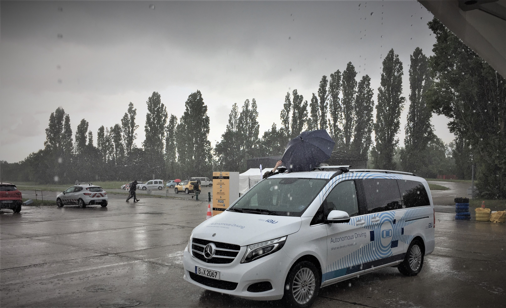  |
|:--:|
| *Roof sensors of the IAV GmbH vehicle had to be specially protected from rain. Source: author provided.* |

A research team from [TU Delft](http://intelligent-vehicles.org/research/projects/) presented their work on [SafeVRU](https://www.swov.nl/en/project/safevru-safe-interaction-automated-vehicles-vulnerable-road-users), a platform for interaction with *Vulnerable Road Users* (**VRUs**). In the scenario, a pedestrian was entering laterally the path of the AD vehicle. The main goal of the demo was **to detect if the pedestrian saw the car or not**. In the first drive, **no eye contact had been detected**, and an avoidance manoeuvre was performed. In the second drive, the head of the dummy was oriented toward the vehicle that **could detect its sight** *(green confidence at the bottom-left corner)*. The AD vehicle could **deduce that the pedestrian will stop** *(this is a strong assumption)* and consequently did not take an avoidance manoeuvre. With the increasing trend of [Smombie](https://en.wikipedia.org/wiki/Smartphone_zombie), this type of intersection might probably become difficult to capture.

|   |
|:--:|
| *Second drive of TU Delft. This time the walking dummy is looking at us. Source: author provided.* |

A research team from KIT also demonstrated perception and planning in presence of VRUs. It **detects a bicycle** in the right lane and decides to **overtake it, going to the opposite lane**.

|   |
|:--:|
| *Some issues with the localisation system caused the overtaking manoeuvre to be a little bit abrupt. Source: author provided.* |

| 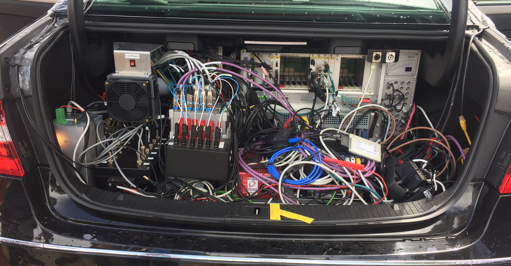  |
|:--:|
| *Back trunk of the KIT car. Source: author provided.* |

| 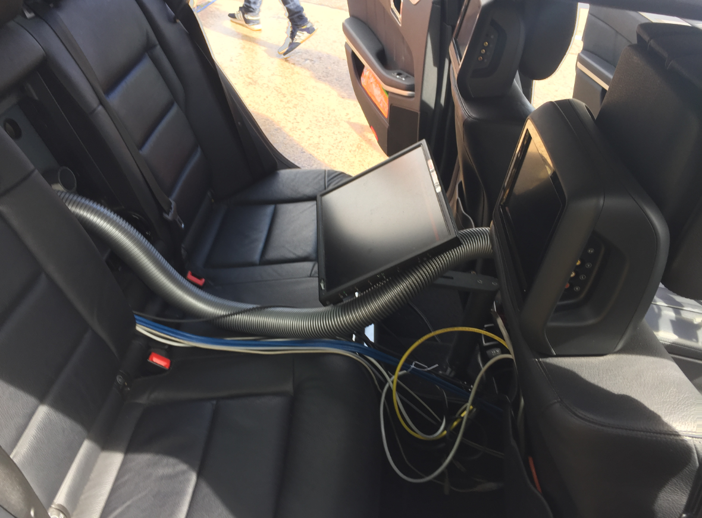  |
|:--:|
| *Air-cooling hose coming from the back trunk of KIT car. Source: author provided.* |

The European project [AutoMate](http://www.automate-project.eu/) project demonstrated **collaboration between the AD vehicle and the human driver** (hence suffix *“mate”* for *“teammate”*). When approaching a roundabout, the human driver, whose attention is constantly monitored, was **asked to take over the lateral control**, i.e. the steering commands. An explanation for this request was given on the onboard display. After exiting the roundabout, the system **proposed to resume the AD mode**.

I found a little bit impressive to drive at 70 km/h on a countryside-like road with the AD mode.

|   |
|:--:|
| *AD system asking for human collaboration when "approaching" a roundabout. Source: author provided.* |

This demonstration raises questions about the cooperation between human driver and the autopilot. Here, the driver cannot be described as “distracted”. He was paying much attention and could therefore quickly take over.

In addition, only one request was submitted during the test. I can imagine it could be **annoying to be repetitively asked** for collaboration. That reminded me an oral session, where a reference to [The Boy Who Cried Wolf fable](https://en.wikipedia.org/wiki/The_Boy_Who_Cried_Wolf) was made to highlight the **risk of false alarms**: too many unnecessary warnings and calls for disengagement **might discourage driver vigilance**.

Another thing I noticed is the **central display**. It is supposed to **inform the driver about the reason of disengagement**. But it may be not easy to understand, especially given the of risk/importance of the situation and the short time available to react. **OEMs still must prove** that **handover** of vehicle control can be done **safely**, **intuitively**, without **“disrupting user experience”**. 😉

> To me, it is harder to monitor the autopilot than to drive on my own.

This also raises the question of the **driving licence**. In the aviation domain, pilots are trained to handle such transitions and to collaborate. Introducing **level-3 vehicles** (sometimes called *“conditionally-automated”*) in hands of **untrained people** is questionable. In the debate over **supervised vs unsupervised driving modes**, multiple OEMs have already announced they will **skip level-3**, arguing that **this handover of control is unsafe**.

A research team from UTC presented a **cooperative communication** between two vehicles for roundabout crossing. When arriving at the entrance, our vehicle **agreed** with the vehicle driving on roundabout **who should go first**. This V2V solution removes the need for the **challenging inference of intention**. Given **all participants are connected**.

|   |
|:--:|
| *V2V communication for roundabout crossing. Source: author provided.* |

I felt very comfortable on the forest track driven by the Valeo [Drive4U® Urban Pilot](https://www.valeo.com/en/valeo-drive4u-the-first-autonomous-car-to-be-demonstrated-on-the-streets-of-paris/). Moreover, and compared to other AD demonstrators, all sensors were embedded and there was almost no cable visible in the vehicle cabin. And they did not hide everything in the back trunk. 😉

| 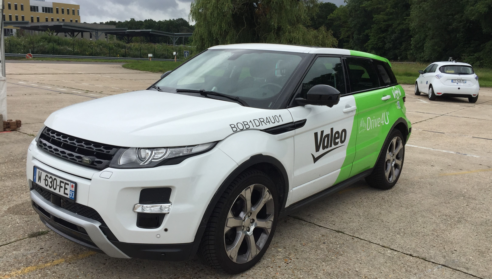  |
|:--:|
| *Valeo Drive4U® Urban Pilot. Source: author provided.* |

PSA did not show any prototype. Instead I could test a pre-series car with ADAS features like *Autonomous Emergency Braking* (AEB). **AEB was demonstrated with a static target**. From the passenger seat, I found the braking manoeuvre impressive, even at **25km/h**. The car managed to stop before the static "dummy" *(yes, this is the term)* without any contact (approx. one-meter gap).

|   |
|:--:|
| *AEB at 25 km/h with a static dummy. Source: author provided.* |

### Miscellaneous Comments

| . Convenient to display multiple windows. Source: author provided.](media/pics/kit_rviz.JPG "Most teams were using ROS (ROS1 or ROS2) and the related visualization tool [RViz](http://wiki.ros.org/rviz). Convenient to display multiple windows. Source: author provided.")  |
|:--:|
| *Most teams were using ROS (ROS1 or ROS2) and the related visualization tool [RViz](http://wiki.ros.org/rviz). Convenient to display multiple windows. Source: author provided.* |

| 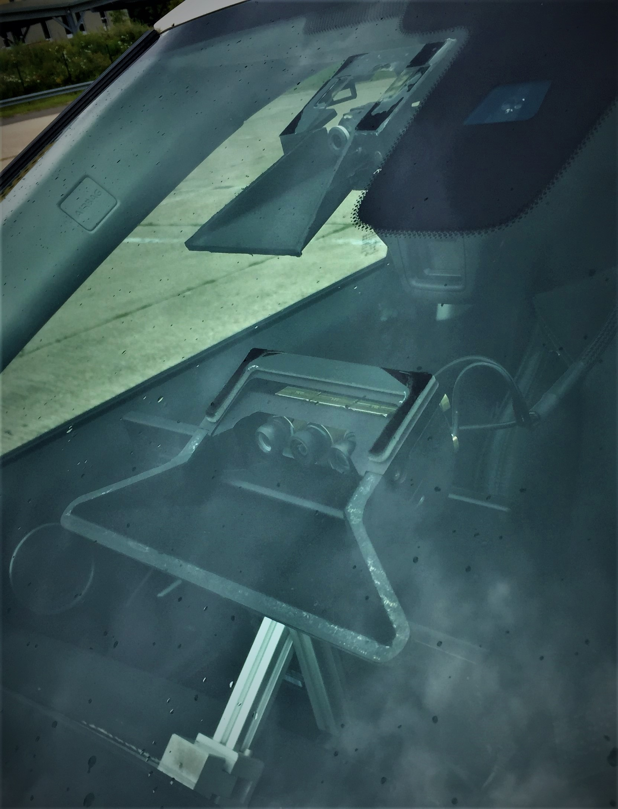  |
|:--:|
| *Most teams were using 3D-printed black casings to prevent reflexion from the dashboard in their cameras. Source: author provided.* |

Another comment, about the type of the presented AD vehicles. Most were car-like. And during the four days of workshop, conference and demonstration, I was surprise not to see more **AD applications for trucks**. Due to its **market size** and its **market value**, and considering he **might present lighter technical challenges** than for AD cars, self-driving trucks are sometimes [predicted to be first to market](https://medium.com/redpoint-ventures/why-self-driving-trucks-will-be-first-to-market-and-why-we-invested-in-ike-6a8f8114c8ec). Nevertheless, **truck applications were almost absent from IV19**. If they were used multiple times as slow dynamic obstacles to avoid, the term “truck” was present in only seven abstracts.

### Discussions With Some Sponsors

Several sponsors were presented solution during the conference. I talked to two of them. Sorry, I do not have anything to show here.

[Intempora](https://intempora.com/) presented, among other, its [Intempora Validation Suite](https://intempora.com/products/ivs-intempora-validation-suite.html) (IVS). No, it does not stand for "Intelligent Vehicle Symposium". 😜

IVS allows to centralize, store and share **recorded sensor data**. Descriptions of the driving situations are added. It is then possible to **search for a specific traffic situation**. Convenient for **regression tests** and for **debugging**.

I was showed how to **quickly retrieve all recorded highway scenarios** where the ego-car was driving on the **left-lane**, with a speed **higher than 110km/h**, while **taking over a truck**. Obviously the quality of this **tag-based search relies on annotations**. They can be done online or offline.

EasyMile and safety validation.

I really enjoyed discussing with some of the engineers from EasyMile! They stressed the importance of the **development process** for **safety validation**. They took the example of the aviation domain where some **sensors must be made redundant** and must even originate from two different manufacturers. This is currently not the case for AD where, despite multi-modality in perception, there is usually one single camera per direction. What is more important to the safety validation authorities is **how the full system has been developed**. In particular the **“safety checker”** that **runs in parallel to the driving functions** must have been **developed independently** of these driving functions, by an **independent team**.

## Conclusion

Tom Vöge ended his keynote with a **gentle joke to EasyMile**. He mentioned the EU-funded project [parkshut](https://staff.washington.edu/jbs/itrans/parkshut.htm) to was developing an AD shuttle service. The park shuttle was released to the public in April 1999. He said:

> “Twenty years later we are still at the same point with AD: demonstration”.

|  - [bottom](https://www.facebook.com/EasyMile/).](media/pics/easymile_vs_park_shuttle.jpg "ParkShuttle (1999) and EasyMile (2019). Sources: [top](https://staff.washington.edu/jbs/itrans/parkshut.htm) - [bottom](https://www.facebook.com/EasyMile/).")  |
|:--:|
| *ParkShuttle (1999) and EasyMile (2019). Sources: [top](https://staff.washington.edu/jbs/itrans/parkshut.htm) - [bottom](https://www.facebook.com/EasyMile/).* |

This is a little bit unfair for EasyMile since they are one of the very few to already operate AD vehicles with public. But this punchy conclusion reminded everyone that **we still have a long way to go before AD exit, and become beneficial for the society**.

## A Last Word

IV19 was my first scientific symposium. I could meet leading-edge researchers and engineers in my domain of interest while broadening my perspectives on other AD topics.

Again, many thanks at [ESR Labs AG](https://www.esrlabs.com) for this great opportunity. I am now looking forward to implementing the learnt lessons to [some of our projects](https://www.esrlabs.com/works/autonomous).

### Save The Date - an some dollars :bowtie:

[IV20](https://2020.ieee-iv.org/) will take place in Las Vegas, June 23-26, while Japan will host IV21, with probably a lot of amazing demos to show after the 2020 Olympics.

| 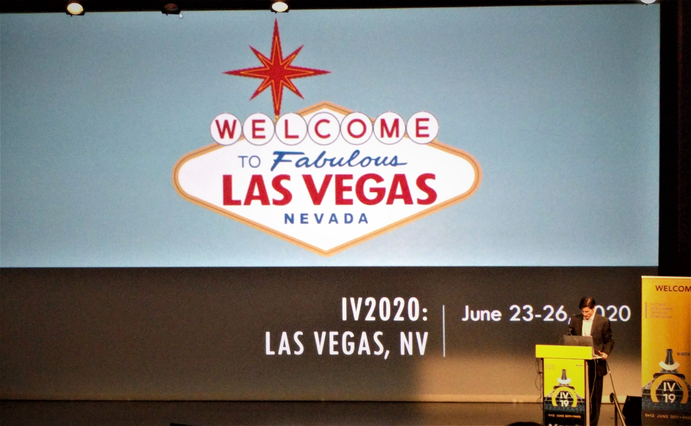  |
|:--:|
| *Brendan Morris advertising IV20. Source: author provided* |

## References

Akai, Naoki et al. [2019].
**“Driving Behavior Modeling Based on Hidden Markov Models with Driver’s Eye-Gaze Measurement and Ego-Vehicle Localization”**
[[pdf](https://www.researchgate.net/publication/332543438_Driving_Behavior_Modeling_Based_on_Hidden_Markov_Models_with_Driver%27s_Eye-Gaze_Measurement_and_Ego-Vehicle_Localization)]

Alahi, Alexandre et al. [2016].
**“Social LSTM: Human Trajectory Prediction in Crowded Spaces”**
[[pdf](http://cvgl.stanford.edu/papers/CVPR16_Social_LSTM.pdf)]

Barbier, Mathieu et al. [2019].
**“Validation of Perception and Decision-Making Systems for Autonomous Driving via Statistical Model Checking”**
[[pdf](https://hal.inria.fr/hal-02127889/document)]

Barbier, Mathieu, Christian Laugier, Olivier Simonin, and Javier Ibanez-Guzmin. [2018].
**“Probabilistic Decision-Making at Road Intersections: Formulation and Quantitative Evaluation”**
[[pdf](https://hal.inria.fr/hal-01940392/document)]

Bernhard, Julian, and Alois Knoll. [2019].
**“Addressing Inherent Uncertainty: Risk-Sensitive Behavior Generation Using Distributional Reinforcement Learning”**
[[html](https://mediatum.ub.tum.de/node?id=1485138)]

Bouton, Maxime, Alireza Nakhaei, Kikuo Fujimura, and Mykel J Kochenderfer. [2019].
**“Safe Reinforcement Learning with Scene Decomposition for Navigating Complex Urban Environments”**
[[pdf](https://arxiv.org/abs/1904.11483)]

Chauvin, Simon. [2018].
**“Hierarchical Decision-Making for Autonomous Driving”**
[[pdf](https://github.com/chauvinSimon/Hierarchical-Decision-Making-for-Autonomous-Driving)]

Chen, Jianyu, Bodi Yuan, and Masayoshi Tomizuka. [2019].
**“Model-Free Deep Reinforcement Learning for Urban Autonomous Driving”**
[[pdf](http://arxiv.org/abs/1904.09503)]

Chen, Longsheng et al. [2019].
**“An Adaptive Path Tracking Controller Based on Reinforcement Learning with Urban Driving Application”**
[-]

Diehl, Frederik, Thomas Brunner, Michael Truong Le, and Alois Knoll. [2019].
**“Graph Neural Networks for Modelling Traffic Participant Interaction”**
[[pdf](https://arxiv.org/abs/1903.01254)]

Driggs-Campbell, Katherine, Roy Dong, S. Shankar Sastry, and Ruzena Bajcsy. [2017].
**“Robust, Informative Human-in-the-Loop Predictions via Empirical Reachable Sets”**
[[pdf](https://arxiv.org/abs/1705.00748)]

Esterle, Klemens, Vincent Aravantinos, and Alois Knoll. [2019].
**“From Specifications to Behavior: Maneuver Verification in a Semantic State Space”**
[[pdf](https://arxiv.org/abs/1905.00708)]

Folkers, Andreas, Matthias Rick, and B Christof. [2019].
**“Controlling an Autonomous Vehicle with Deep Reinforcement Learning”**
[-]

Hartmann, Michael, and Daniel Watzenig. [2019].
**“Optimal Motion Planning with Reachable Sets of Vulnerable Road Users”**
[-]

Hoel, Carl-Johan et al. [2019].
**“Combining Planning and Deep Reinforcement Learning in Tactical Decision Making for Autonomous Driving”**
[[pdf](https://arxiv.org/abs/1905.02680)]

Hu, Yeping, Wei Zhan, and Masayoshi Tomizuka. [2019].
**“Multi-Modal Probabilistic Prediction of Interactive Behavior via an Interpretable Model”**
[[pdf](https://arxiv.org/abs/1903.09381)]

Hubmann, Constantin et al. [2019].
**“A POMDP Maneuver Planner For Occlusions in Urban Scenarios”**
[-]

Joonatan, Mänttäri, and John Folkesson. [2019].
**“Incorporating Uncertainty in Predicting Vehicle Maneuvers at Intersections With Complex Interactions”**
[-]

Kang, Yue, Hang Yin, and Christian Berger. [2018].
**“Test Your Self-Driving Algorithm : An Overview of Publicly Available Driving Datasets and Virtual Testing Environments”**
[[pdf](https://www.researchgate.net/publication/331723628_Test_Your_Self-Driving_Algorithm_An_Overview_of_Publicly_Available_Driving_Datasets_and_Virtual_Testing_Environments)]

Kapania, Nitin R., Vijay Govindarajan, Francesco Borrelli, and J. Christian Gerdes. [2019].
**“A Hybrid Control Design for Autonomous Vehicles at Uncontrolled Crosswalks”**
[[pdf](https://arxiv.org/abs/1902.00597)]

Klischat, Moritz, and Matthias Althoff. [2019].
**“Generating Critical Test Scenarios for Automated Vehicles with Evolutionary Algorithms”**
[[pdf](https://www.researchgate.net/publication/333186174_Generating_Critical_Test_Scenarios_for_Automated_Vehicles_with_Evolutionary_Algorithms)]

Koenig, Alexander, Tobias Rehder, and Soeren Hohmann. [2017].
**“Exact Inference and Learning in Hybrid Bayesian Networks for Lane Change Intention Classification”**
[[html](https://ieeexplore.ieee.org/document/7995927/)]

Kong, Jason, Mark Pfeiffer, Georg Schildbach, and Francesco Borrelli. [2015].
**“Kinematic and Dynamic Vehicle Models for Autonomous Driving Control Design”**
[[pdf](https://borrelli.me.berkeley.edu/pdfpub/IV_KinematicMPC_jason.pdf)]

Lee, Namhoon et al. [2017].
**“DESIRE : Distant Future Prediction in Dynamic Scenes with Interacting Agents”**
[[pdf](https://arxiv.org/abs/1704.04394)]

Li, Jiachen, Hengbo Ma, Wei Zhan, and Masayoshi Tomizuka. [2019].
**“Coordination and Trajectory Prediction for Vehicle Interactions via Bayesian Generative Modeling”**
[[pdf](http://arxiv.org/abs/1905.00587)]

Li, Yang et al. [2019].
**“Pedestrian Trajectory Prediction With Learning-Based Approaches : A Comparative Study”**
[-]

Ma, Hengbo, Jiachen Li, Wei Zhan, and Masayoshi Tomizuka. [2019].
**“Wasserstein Generative Learning with Kinematic Constraints for Probabilistic Prediction of Interactive Driving Behavior”**
[-]

Naumann, Maximilian, Hendrik Königshof, Martin Lauer, and Christoph Stiller. [2019].
**“Safe but Not Overcautious Motion Planning under Occlusions and Limited Sensor Range”**
[[pdf](https://www.mrt.kit.edu/z/publ/download/2019/Naumann2019Occlusions.pdf)]

Orzechowski, Piotr F, Annika Meyer, and Martin Lauer. [2018].
**“Tackling Occlusions & Limited Sensor Range with Set-based Safety Verification”**
[[pdf](https://arxiv.org/abs/1807.01262)]

Pierson, Alyssa, Wilko Schwarting, Sertac Karaman, and Daniela Rus. [2019].
**“Learning Risk Level Set Parameters from Data Sets for Safer Driving”**
[-]

Pool, Ewoud A I, Julian F P Kooij, and Dariu M Gavrila. [2019].
**“Context-Based Cyclist Path Prediction Using Recurrent Neural Networks”**
[-]

Pusse, Florian, and Matthias Klusch. [2019].
**“Hybrid Online POMDP Planning and Deep Reinforcement Learning for Safer Self-Driving Cars”**
[[html](https://www.dfki.de/en/web/research/projects-and-publications/publications/publication/10337/)]

Queiroz, Rodrigo, Thorsten Berger, and Krzysztof Czarnecki. [2019].
**“GeoScenario : An Open DSL for Autonomous Driving Scenario Representation”
[[pdf](http://www.cse.chalmers.se/~bergert/paper/2019-iv-geoscenario.pdf)]

Rehder, Tobias et al. [2019].
**“Lane Change Intention Awareness for Assisted and Automated Driving on Highways”**
[[html](https://www.researchgate.net/publication/331913422_Lane_Change_Intention_Awareness_for_Assisted_and_Automated_Driving_on_Highways)]

Schörner, Philip, T Lars, Jens Doll, and J Z Marius. [2019].
**“Predictive Trajectory Planning in Situations with Hidden Road Users Using Partially Observable Markov Decision Processes”**
[[pdf](https://www.ifr.ing.tu-bs.de/static/files/forschung/papers/download_pdf.php?id=739)]

Schratter, Markus, Maxime Bouton, Mykel J. Kochenderfer, and Daniel Watzenig. [2019].
**“Pedestrian Collision Avoidance System for Scenarios with Occlusions”**
[[pdf](https://arxiv.org/abs/1904.11566)]

Schulz, Jens et al. [2019].
**“Learning Interaction-Aware Probabilistic Driver Behavior Models from Urban Scenarios”**
[-]

Si, Wenwen, and Changliu Liu. [2019].
**“AGen : Adaptable Generative Prediction Networks for Autonomous Driving”**
[[html](https://www.ri.cmu.edu/publications/agen-adaptable-generative-prediction-networks-for-autonomous-driving/)]

Sun, Liting, Wei Zhan, Ching-Yao Chan, and Masayoshi Tomizuka. [2019].
**“Behavior Planning of Autonomous Cars with Social Perception”**
[[pdf](https://arxiv.org/abs/1905.00988)]

Sunberg, Zachary, and Mykel Kochenderfer. [2017].
**“Online Algorithms for POMDPs with Continuous State, Action, and Observation Spaces”**
[[pdf](https://arxiv.org/abs/1709.06196)]

Ulbrich, Simon et al. [2015].
**“Defining and Substantiating the Terms Scene , Situation , and Scenario for Automated Driving”**
[[pdf](https://www.ifr.ing.tu-bs.de/static/files/forschung/papers/download_pdf.php?id=859)]

Ure, N Kemal, M Ugur Yavas, Ali Alizadeh, and Can Kurtulus. [2019].
**“Enhancing Situational Awareness and Performance of Adaptive Cruise Control through Model Predictive Control and Deep Reinforcement Learning”**
[-]

Zernetsch, Stefan et al. [2019].
**“Trajectory Forecasts with Uncertainties of Vulnerable Road Users by Means of Neural Networks**
[-]

## Temp GIF

|   |
|:--:|
| *INTERACTION dataset* |

|   |
|:--:|
| *pascal_fantassin.gif* |

## Temp PICS

| 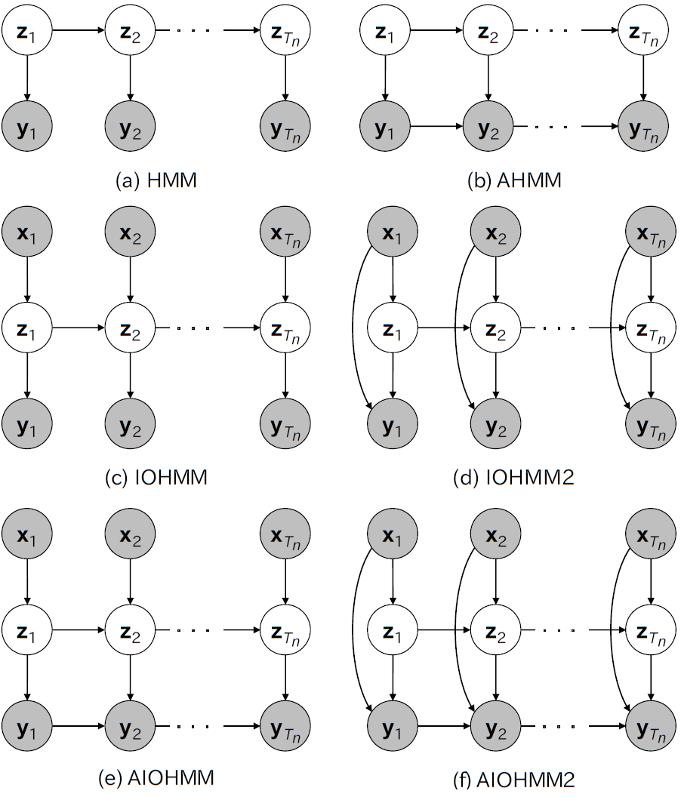  |
|:--:|
| *akai_hmm_types.png* |

| 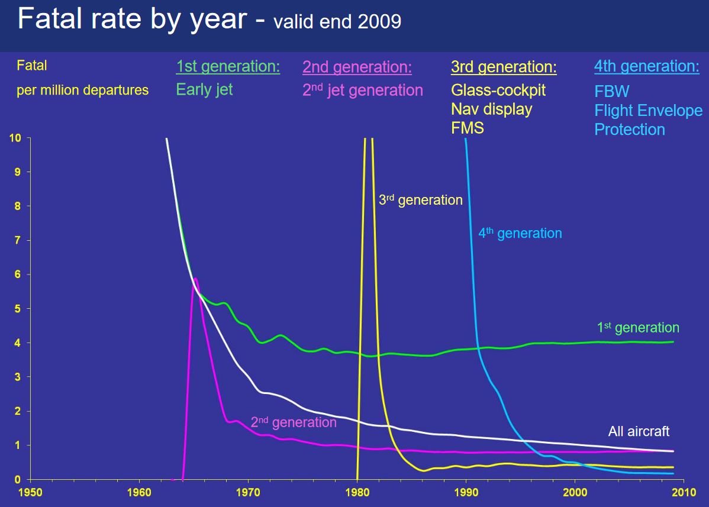  |
|:--:|
| *chatrenet_automation_vs_fatalities.PNG* |

| 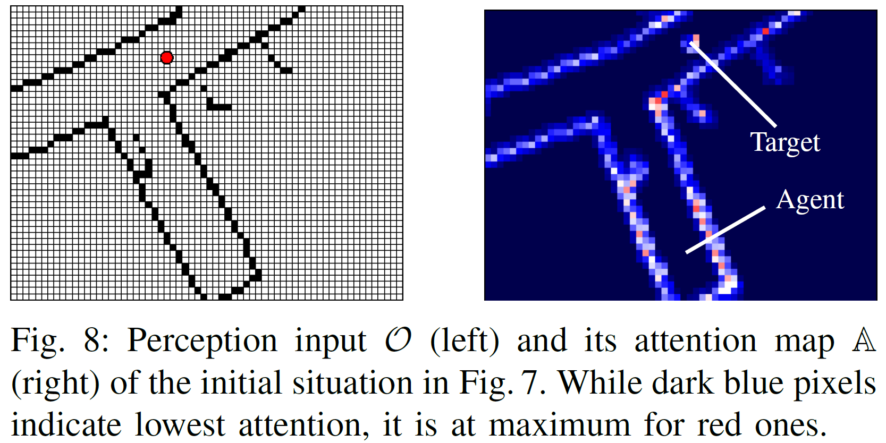  |
|:--:|
| *folkers_attention.PNG* |

| 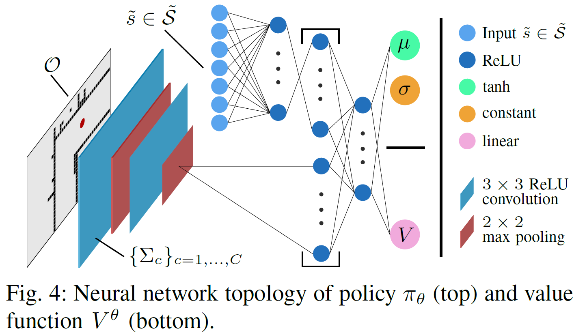  |
|:--:|
| *folkers_hybrid_input.PNG* |

| 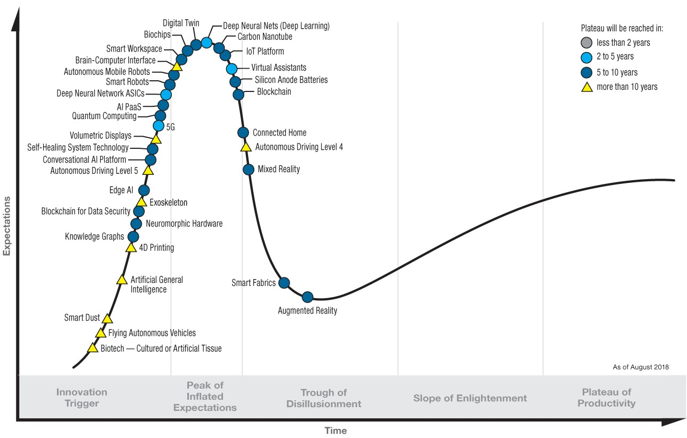  |
|:--:|
| *gartner18.jpg* |

| 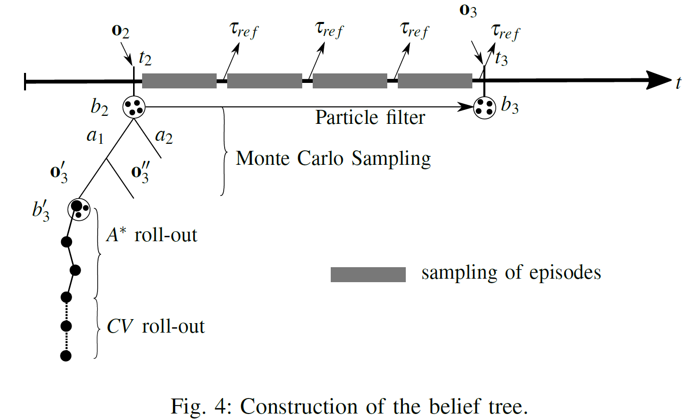  |
|:--:|
| *hubmann_contruction_belief_tree.PNG* |

| 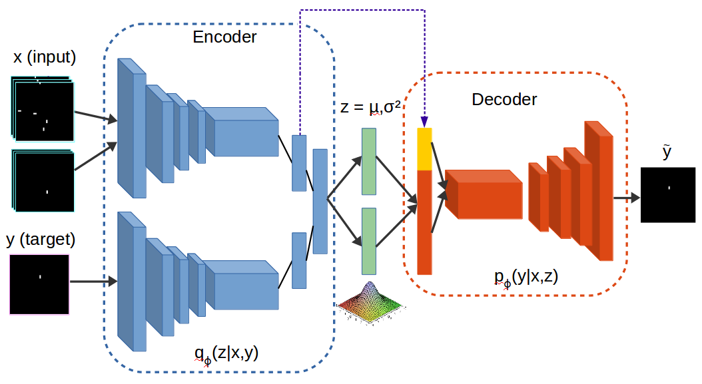  |
|:--:|
| *joonatan_CVAE.png* |

| 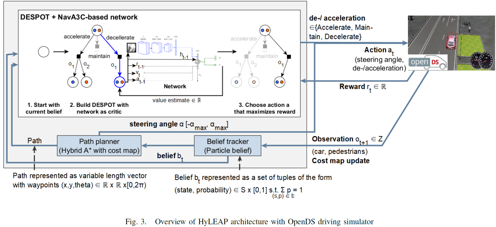  |
|:--:|
| *pusse_architecture.PNG* |

| 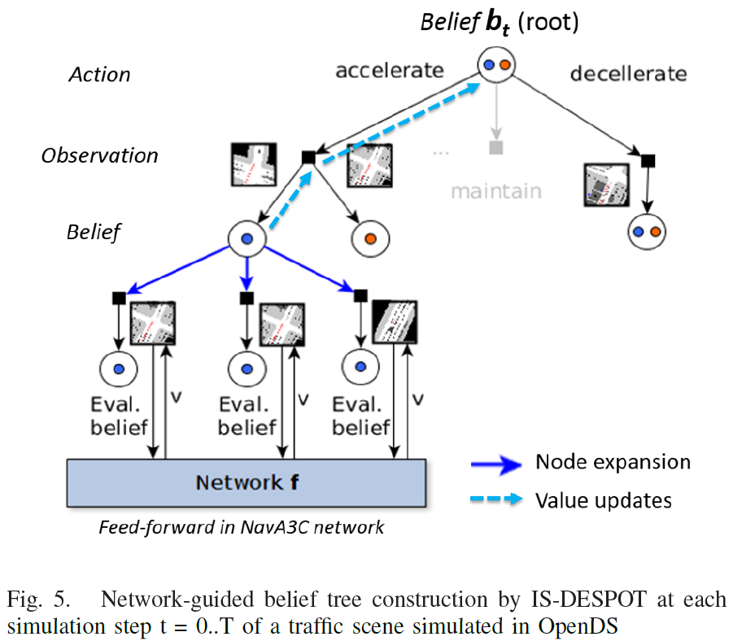  |
|:--:|
| *pusse_tree.PNG* |

| 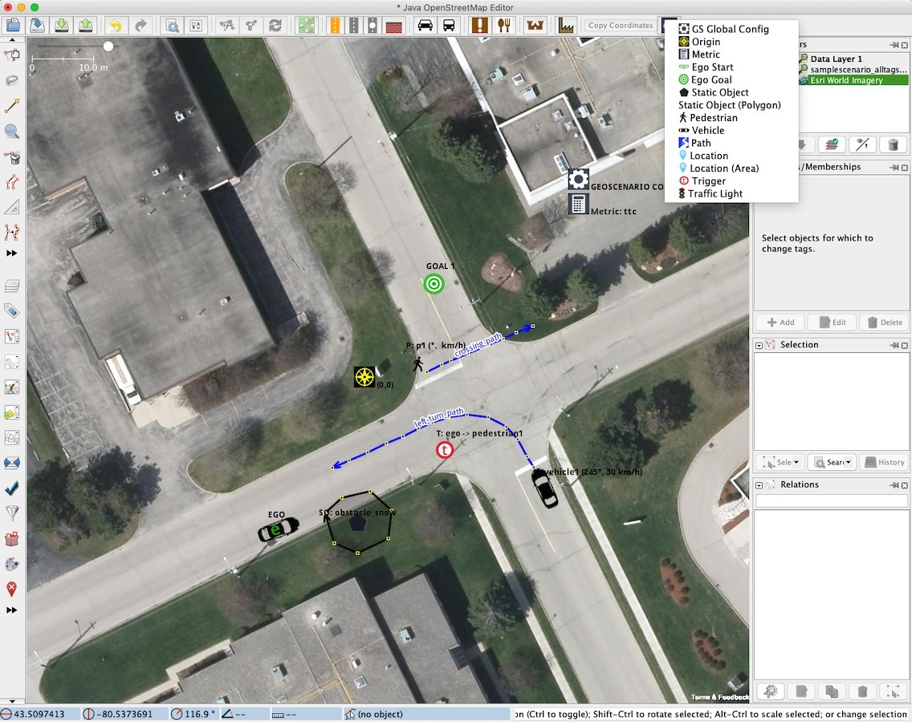  |
|:--:|
| *queiroz_geoScenario_tool.jpg* |

| 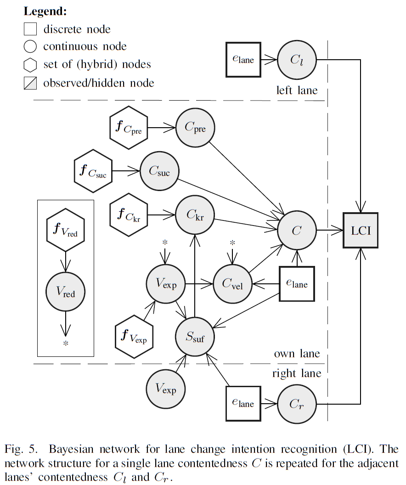  |
|:--:|
| *rehder_DBN.PNG* |

| 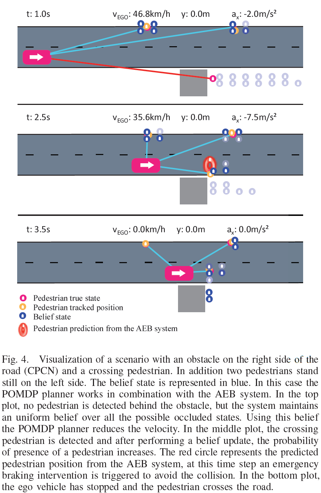  |
|:--:|
| *schratter_belief.PNG* |

| 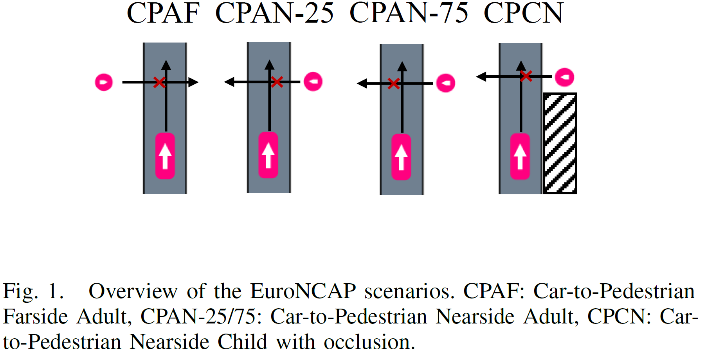  |
|:--:|
| *schratter_NCAP.PNG* |

| 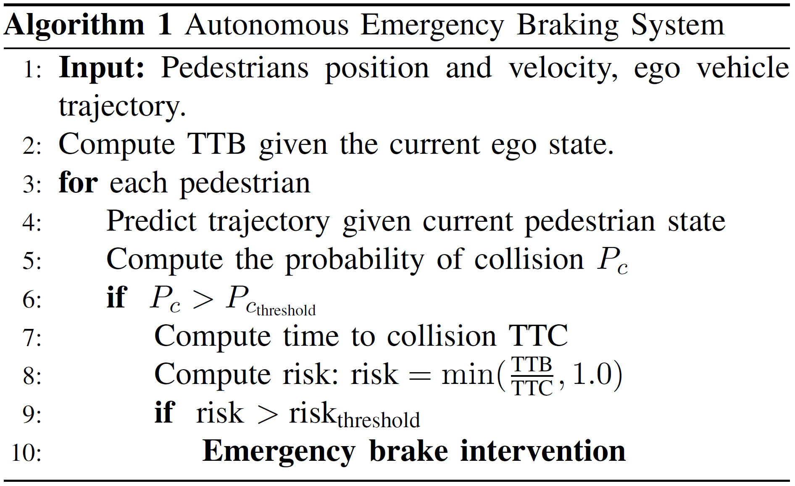  |
|:--:|
| *schratter_risk_assessement.PNG* |

| 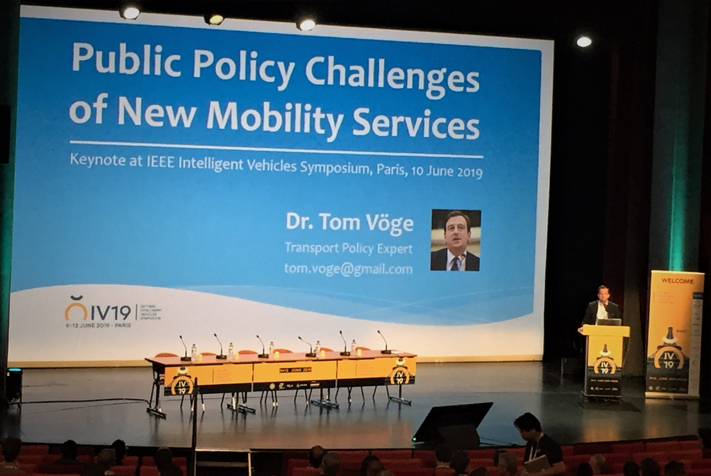  |
|:--:|
| *vöge_keynote.JPG* |

| 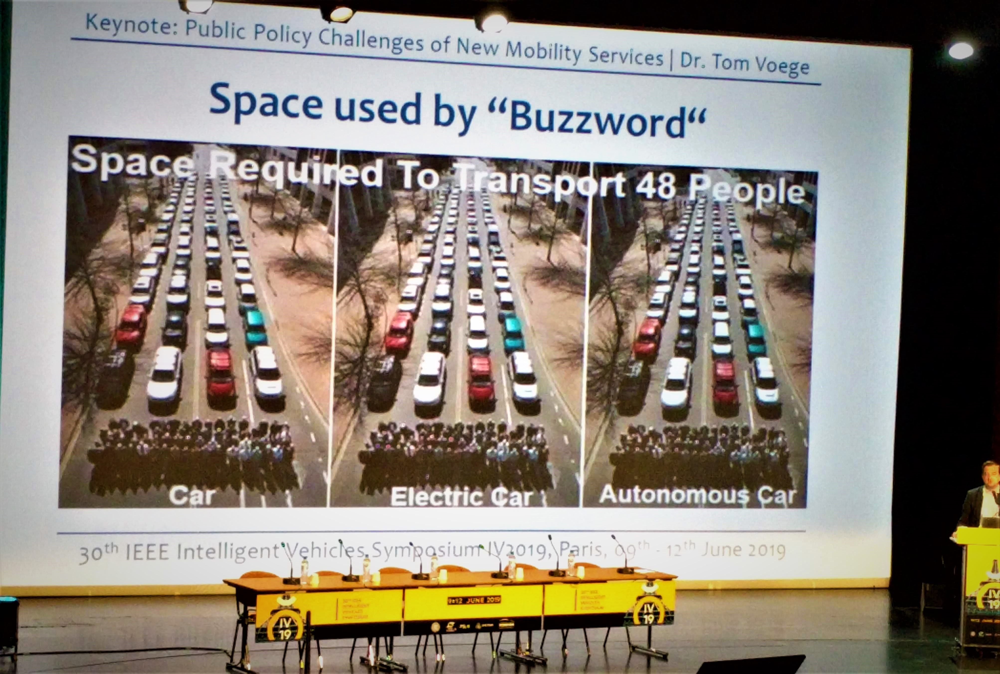  |
|:--:|
| *vöge_sharing.jpg* |

|   |
|:--:|
| *weast_keynote.jpg* |